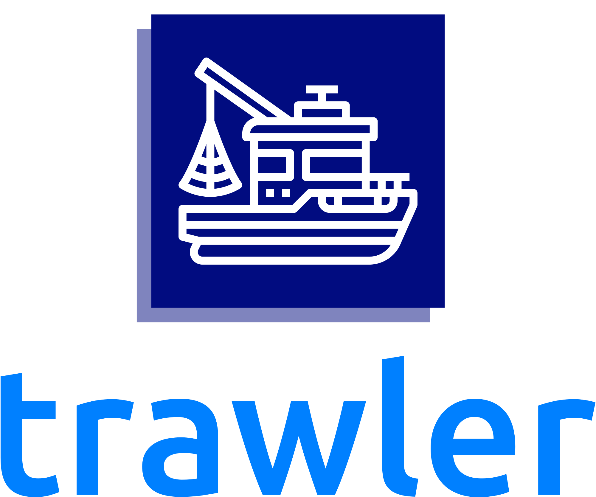
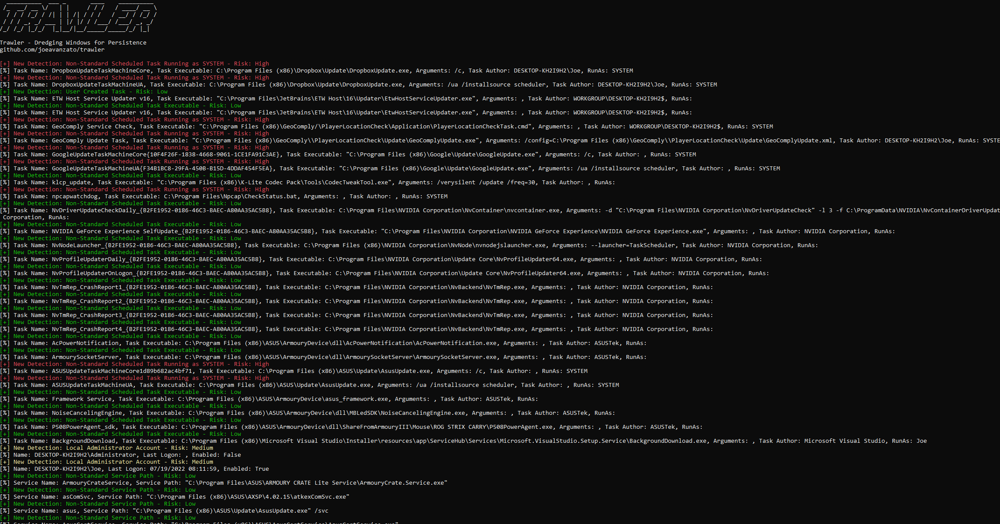

<p align="center">

</p>
<h1 align="center">
Dredging Windows for Persistence 
</h1>

## What is it?

Trawler is a PowerShell script designed to help Incident Responders discover potential indicators of compromise on Windows hosts, primarily focused on persistence mechanisms including Scheduled Tasks, Services, Registry Modifications, Startup Items, Binary Modifications and more.

Currently, trawler can detect most of the persistence techniques specifically called out by MITRE and Atomic Red Team with more detections being added on a regular basis.

## Main Features

* Scanning Windows OS for a variety of persistence techniques (Listed below)
* CSV Output with MITRE Technique and Investigation Jumpstart Metadata
* Analysis and Remediation Guidance Documentation (https://github.com/joeavanzato/Trawler/wiki/Analysis-and-Remediation-Guidance)
* Dynamic Risk Assignment for each detection
* Built-in Allow Lists for common Windows configurations spanning Windows 10/Server 2012|2016|2019|2022 to reduce noise
* Capture persistence metadata from 'golden' enterprise image for use as a dynamic allow-list at runtime
* Analyze mounted disk images via drive re-targeting

## How do I use it?
Just download and run trawler.ps1 from an Administrative PowerShell/cmd prompt - any detections will be displayed in the console as well as written to a CSV ('detections.csv') in the current working directory.  The generated CSV will contain Detection Name, Source, Risk, Metadata and the relevant MITRE Technique.

Or use this one-liner from an Administrative PowerShell terminal:
```
iex ((New-Object System.Net.WebClient).DownloadString('https://raw.githubusercontent.com/joeavanzato/Trawler/main/trawler.ps1'))
```

Certain detections have allow-lists built-in to help remove noise from default Windows configurations (10/2016/2019/2022) - expected Scheduled Tasks, Services, etc.  Of course, it is always possible for attackers to hijack these directly and masquerade with great detail as a default OS process - take care to use multiple forms of analysis and detection when dealing with skillful adversaries.

If you have examples or ideas for additional detections, please feel free to submit an Issue or PR with relevant technical details/references - the code-base is a little messy right now and will be cleaned up over time.

Additionally, if you identify obvious false positives, please let me know by opening an issue or PR on GitHub!  The obvious culprits for this will be non-standard COMs, Services or Tasks.

### CLI Parameters
```
-hide : Suppress Detection output to console
-snapshot : Capture a "persistence snapshot" of the current system, defaulting to "$PSScriptRoot\snapshot.csv"
-snapshotpath : Define a custom file-path for saving snapshot output to.
-outpath : Define a custom file-path for saving detection output to (defaults to "$PSScriptRoot\detections.csv")
-loadsnapshot : Define the path for an existing snapshot file to load as an allow-list reference
-drivetarget : Define the variable for a mounted target drive (eg. .\trawler.ps1 -targetdrive "D:") - using this alone leads to an 'assumed homedrive' variable of C: for analysis purposes
```

## What separates this from PersistenceSniper?
PersistenceSniper is an awesome tool - I've used it heavily in the past - but there are a few key points that differentiate these utilities
* trawler is (currently) a local utility - it would be pretty straight-forward to wrap it in a loop and use WinRM/PowerShell Sessions to execute it on remote hosts though
* trawler implements allow-listing for many 'noisy' detections to help remove expected detections from default configurations of Windows (10/2016/2019/2022) and these are constantly being updated
  * PersistenceSniper does not contain any type of allow-listing - therefore, there is more noise generated when considering items such as Services, Scheduled Tasks, general COM DLL scanning, etc.
* trawler's output is much more simplified - Name, Risk, Source, MITRE Technique and Metadata are the only items provided for each detection to help analysts jump-start their persistence hunting efforts
* Regex is used heavily to help detect 'suspicious' keywords in various critical areas
* trawler supports 'snapshotting' a system (for example, an enterprise golden image) then using the generated snapshot as an allow-list to reduce noise.

Overall, these tools are extremely similar but approach the problem from slightly different angles - PersistenceSniper provides all information back to the analyst for review while Trawler tries to limit what is returned to only results that are likely to be potential adversary persistence mechanisms.  As such, there is a possibility for false-negatives with trawler if an adversary completely mimics an allow-listed item.

## Tuning to your environment
Trawler supports loading an allow-list from a 'snapshot' - to do this requires two steps.
1. Run '.\trawler.ps1 -snapshot' on a "Golden Image" representing the servers in your environment - once complete, in addition to the standard 'detections.csv' a file named 'snapshots.csv' will be generated
2. This file can then be used as input to trawler when running on other hosts and the data will be loaded dynamically as an allow-list for each appropriate detection
   1. '.\trawler.ps1' -loadsnapshot "path\to\snapshot.csv"

That's it - all relevant detections will then draw from the snapshot file as an allow-list to reduce noise and identify any potential changes to the base image that may have occurred.

(Allow-listing is implemented for most of the checks but not all - still being actively implemented)

## Drive ReTargeting
Often during an investigation, analysts may end up mounting a new drive that represents an imaged Windows device - Trawler now partially supports scanning these mounted drives through the use of the '-drivetarget' parameter.

At runtime, Trawler will re-target temporary script-level variables for use in checking file-based artifacts and also will attempt to load relevant Registry Hives (HKLM\SOFTWARE, HKLM\SYSTEM, NTUSER.DATs, USRCLASS.DATs) underneath HKLM/HKU and prefixed by 'ANALYSIS_'.  Trawler will also attempt to unload these temporarily loaded hives upon script completion.

As an example, if you have an image mounted at a location such as 'F:\Test' which contains the NTFS file system ('F:\Test\Windows', 'F:\Test\User', etc) then you can invoke trawler like below;
```powershell
.\trawler.ps1 -drivetarget "F:\Test"
```
Please note that since trawler attempts to load the registry hive files from the drive in question, mapping a UNC path to a live remote device will NOT work as those files will not be accessible due to system locks.  I am working on an approach which will handle live remote devices, stay tuned.

### What is not inspected when drive retargeting?
* Running Processes
* Network Connections
* 'Phantom' DLLs
* WMI Consumers (Being worked on)
* BITS Jobs (Being worked on)
* Certificate Parsing (Being worked on)

Most other checks will function fine because they are based entirely on reading registry hives or file-based artifacts (or can be converted to do so, such as directly reading Task XML as opposed to using built-in command-lets.)

Any limitations in checks when doing drive-retargeting will be discussed more fully in the GitHub Wiki.

## Example Images
<p align="center">

</p>
<p align="center">

</p>
<p align="center">

</p>

## What is inspected?

* Scheduled Tasks
* Users
* Services
* Running Processes
* Network Connections
* WMI Event Consumers (CommandLine/Script)
* Startup Item Discovery
* BITS Jobs Discovery
* Windows Accessibility Feature Modifications
* PowerShell Profile Existence
* Office Addins from Trusted Locations
* SilentProcessExit Monitoring
* Winlogon Helper DLL Hijacking
* Image File Execution Option Hijacking
* RDP Shadowing
* UAC Setting for Remote Sessions
* Print Monitor DLLs
* LSA Security and Authentication Package Hijacking
* Time Provider DLLs
* Print Processor DLLs
* Boot/Logon Active Setup
* User Initialization Logon Script Hijacking
* ScreenSaver Executable Hijacking
* Netsh DLLs
* AppCert DLLs
* AppInit DLLs
* Application Shimming
* COM Object Hijacking
* LSA Notification Hijacking
* 'Office test' Usage
* Office GlobalDotName Usage
* Terminal Services DLL Hijacking 
* Autodial DLL Hijacking
* Command AutoRun Processor Abuse
* Outlook OTM Hijacking
* Trust Provider Hijacking
* LNK Target Scanning (Suspicious Terms, Multiple Extensions, Multiple EXEs)
* 'Phantom' Windows DLL Names loaded into running process (eg. un-signed WptsExtensions.dll)
* Scanning Critical OS Directories for Unsigned EXEs/DLLs
* Un-Quoted Service Path Hijacking
* PATH Binary Hijacking
* Common File Association Hijacks and Suspicious Keywords
* Suspicious Certificate Hunting
* GPO Script Discovery/Scanning
* NLP Development Platform DLL Overrides
* AeDebug/.NET/Script/Process/WER Debug Replacements
* Explorer 'Load'
* Windows Terminal startOnUserLogin Hijacks
* App Path Mismatches
* Service DLL/ImagePath Mismatches
* GPO Extension DLLs
* Potential COM Hijacks
* Non-Standard LSA Extensions
* DNSServerLevelPluginDll Presence
* Explorer\MyComputer Utility Hijack
* Terminal Services InitialProgram Check
* RDP Startup Programs
* Microsoft Telemetry Commands
* Non-Standard AMSI Providers
* Internet Settings LUI Error DLL
* PeerDist\Extension DLL
* ErrorHandler.CMD Checks
* Built-In Diagnostics DLL
* MiniDumpAuxiliary DLLs
* KnownManagedDebugger DLLs
* WOW64 Compatibility Layer DLLs
* EventViewer MSC Hijack
* Uninstall Strings Scan
* PolicyManager DLLs
* SEMgr Wallet DLL
* WER Runtime Exception Handlers
* HTML Help (.CHM)
* Remote Access Tool Artifacts (Files, Directories, Registry Keys)
* ContextMenuHandler DLL Checks
* Office AI.exe Presence
* Notepad++ Plugins
* MSDTC Registry Hijacks
* Narrator DLL Hijack (MSTTSLocEnUS.DLL)
* Suspicious File Location Checks

TODO
* Add Analysis/Remediation Guidance to each detection in the GitHub Wiki (In-Progress)
* Browser Extension Analysis (?)
* RID Hijacking [https://www.ired.team/offensive-security/persistence/rid-hijacking][https://pentestlab.blog/2020/02/12/persistence-rid-hijacking/]
* PowerAutomate Checks
* ShadowPad Indicators [https://www.secureworks.com/research/shadowpad-malware-analysis, https://www.hexacorn.com/blog/2023/02/25/beyond-good-ol-run-key-part-141/]
* OBS Startup Script Scanning [https://www.hexacorn.com/blog/2023/04/14/beyond-good-ol-run-key-part-142/]
* SQL Server Management Addins [https://www.hexacorn.com/blog/2019/09/28/beyond-good-ol-run-key-part-117/]
* AutoPlay Handler Inspection [HKEY_LOCAL_MACHINE\SOFTWARE\Microsoft\Windows\CurrentVersion\Explorer\AutoplayHandlers\Handlers\]
* HKLM\SOFTWARE\Microsoft\Windows\CurrentVersion\Setup\Pending\SPReviewEnabler
* OCSetup [https://www.hexacorn.com/blog/2019/11/09/beyond-good-ol-run-key-part-122/]
* Review https://hijacklibs.net/# for additional opportunities
* Review https://www.wietzebeukema.nl/blog/hijacking-dlls-in-windows for additional opportunities
* Review https://silentrunners.org/launchpoints.html for additional opportunities

## MITRE Techniques Evaluated

Please be aware that some of these are (of course) more detected than others - for example, we are not detecting all possible registry modifications but rather inspecting certain keys for obvious changes and using the generic MITRE technique "Modify Registry" where no other technique is applicable.  For other items such as COM hijacking, we are inspecting all entries in the relevant registry section, checking against 'known-good' patterns and bubbling up unknown or mismatched values, resulting in a much more complete detection surface for that particular technique.

* T1037: Boot or Logon Initialization Scripts
* T1037.001: Boot or Logon Initialization Scripts: Logon Script (Windows)
* T1037.005: Boot or Logon Initialization Scripts: Startup Items
* T1055.001: Process Injection: Dynamic-link Library Injection
* T1059: Command and Scripting Interpreter
* T1071: Application Layer Protocol
* T1098: Account Manipulation
* T1112: Modify Registry
* T1053: Scheduled Task/Job
* T1136: Create Account
* T1137.001: Office Application Office Template Macros
* T1137.002: Office Application Startup: Office Test
* T1137.006: Office Application Startup: Add-ins
* T1197: BITS Jobs
* T1505.005: Server Software Component: Terminal Services DLL
* T1543.003: Create or Modify System Process: Windows Service
* T1546: Event Triggered Execution
* T1546.001: Event Triggered Execution: Change Default File Association
* T1546.002: Event Triggered Execution: Screensaver
* T1546.003: Event Triggered Execution: Windows Management Instrumentation Event Subscription
* T1546.007: Event Triggered Execution: Netsh Helper DLL
* T1546.008: Event Triggered Execution: Accessibility Features
* T1546.009: Event Triggered Execution: AppCert DLLs
* T1546.010: Event Triggered Execution: AppInit DLLs
* T1546.011: Event Triggered Execution: Application Shimming
* T1546.012: Event Triggered Execution: Image File Execution Options Injection
* T1546.013: Event Triggered Execution: PowerShell Profile
* T1546.015: Event Triggered Execution: Component Object Model Hijacking
* T1547.002: Boot or Logon Autostart Execution: Authentication Packages
* T1547.003: Boot or Logon Autostart Execution: Time Providers
* T1547.004: Boot or Logon Autostart Execution: Winlogon Helper DLL
* T1547.005: Boot or Logon Autostart Execution: Security Support Provider
* T1547.009: Boot or Logon Autostart Execution: Shortcut Modification
* T1547.012: Boot or Logon Autostart Execution: Print Processors
* T1547.014: Boot or Logon Autostart Execution: Active Setup
* T1553: Subvert Trust Controls
* T1553.004: Subvert Trust Controls: Install Root Certificate
* T1556.002: Modify Authentication Process: Password Filter DLL
* T1574: Hijack Execution Flow
* T1574.007: Hijack Execution Flow: Path Interception by PATH Environment Variable
* T1574.009: Hijack Execution Flow: Path Interception by Unquoted Path


## References
This tool would not exist without the amazing InfoSec community - the most notable references I used are provided below.

* [PersistenceSniper](https://github.com/last-byte/PersistenceSniper)
* [MITRE ATT&CK](https://attack.mitre.org/tactics/TA0003/)
* [Persistence Info GitHub](https://persistence-info.github.io/)
* [Hexacorn - Persistence Series](https://www.hexacorn.com/blog/2017/01/28/beyond-good-ol-run-key-all-parts/)
* [IRED](https://www.ired.team/)
* [PayloadsAllTheThings](https://github.com/swisskyrepo/PayloadsAllTheThings)

## More References
* https://twitter.com/Laughing_Mantis/status/1645268114966470662
* https://shellz.club/posts/a-novel-method-for-bypass-ETW/
* https://pentestlab.blog/2023/03/20/persistence-service-control-manager/
* https://ristbs.github.io/2023/02/15/hijack-explorer-context-menu-for-persistence-and-fun.html
* https://pentestlab.blog/2022/02/14/persistence-notepad-plugins/

